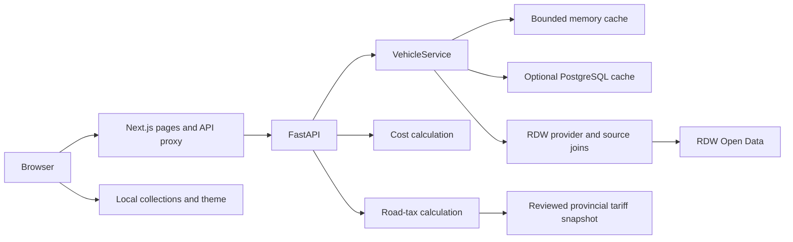

# Architecture

RitVizier is a Next.js/FastAPI monorepo. The browser stores vehicle collections. Optional PostgreSQL stores shared cached responses rather than user accounts. See [Extended check implementation](extended-rdw-check.md) for the source registry, full file map, joins and limits added in the extended check.

## Request flow

`/auto/[plate]` also fetches vehicle data during server rendering. Later browser lookups use the same-origin API proxy. `BACKEND_URL` stays server-side; mobile clients never need access to `127.0.0.1:8000`.

## Code map

| Area                      | Location                                                                                   | Responsibility                                            |
| ------------------------- | ------------------------------------------------------------------------------------------ | --------------------------------------------------------- |
| Routes/styles             | `frontend/src/app/`                                                                        | Pages, metadata, proxies, CSS tokens and responsive rules |
| Vehicle view              | `frontend/src/features/vehicle-details/`                                                   | Data sections, tabs, dates and sources                    |
| Ownership costs           | `frontend/src/features/ownership-costs/`                                                   | Editable assumptions, tax selection and estimate          |
| Comparison/saved vehicles | `frontend/src/features/comparison/`, `frontend/src/features/favourites/`                   | Collection workflows                                      |
| Reused controls           | `frontend/src/components/`                                                                 | Navigation, theme, search, badges and data rows           |
| Frontend contract         | `frontend/src/types/vehicle.ts`                                                            | Zod validation and TypeScript vehicle type                |
| Client utilities          | `frontend/src/lib/`                                                                        | Storage, normalization, formatting and requests           |
| API                       | `backend/app/main.py`                                                                      | Routes, validation, errors, rate limits and lifespan      |
| Backend contract          | `backend/app/schemas/vehicle.py`                                                           | Pydantic vehicle/source schema and field aliases          |
| RDW retrieval             | `backend/app/providers/rdw.py`                                                             | Parallel retrieval, normalization and joins               |
| Cache service             | `backend/app/services/vehicles.py`                                                         | Coalescing, freshness and persisted schema checks         |
| Calculations              | `backend/app/services/costs.py`, `backend/app/services/road_tax.py`                        | Validated cost/tax rules                                  |
| Persistence               | `backend/app/db/`, `backend/alembic/`                                                      | Async PostgreSQL cache and migrations                     |
| Tariff data/updater       | `backend/app/data/road_tax_2026.json`, `backend/scripts/update_road_tax.py`                | Reviewed tables and numeric asset parsing                 |
| Runtime/smoke             | `scripts/`                                                                                 | Standalone startup, live API and LAN checks               |
| Tests/CI                  | `backend/tests/`, `frontend/e2e/`, `frontend/src/**/*.test.ts`, `.github/workflows/ci.yml` | Fixture isolation and regression checks                   |

## API contracts

Market adverts have a separate contract in `schemas/listings.py` and `frontend/src/types/listings.ts`. `GET /api/listings` reads a bounded server-configured stock snapshot through `services/listings.py`, groups cross-site duplicate adverts and applies filters/pagination. Next.js proxies the endpoint. See [listing search](listing-search.md) for import, identity rules and freshness. These adverts do not alter official vehicle records, the RDW cache or saved browser vehicles.

Local backend OpenAPI documentation is at `http://127.0.0.1:8000/docs` when running.

| Endpoint                    | Behavior                                                                                                                                                                                               |
| --------------------------- | ------------------------------------------------------------------------------------------------------------------------------------------------------------------------------------------------------ |
| `GET /health`               | Process health only; does not test RDW or PostgreSQL availability.                                                                                                                                     |
| `GET /api/vehicles/{plate}` | Normalize plate and return vehicle/source metadata. Invalid plate: 422; absent vehicle: 404; provider failure: 502; provider timeout: 504; local/upstream rate limit: 429.                             |
| `GET /api/listings`         | Search the configured snapshot with filters, grouping and pagination. Missing or stale feeds return an unavailable result; invalid queries return 422.                                                 |
| `POST /api/costs`           | Validate assumptions and compute monthly/yearly running costs. Full limits are in `CostAssumptions` in `services/costs.py`.                                                                            |
| `POST /api/road-tax`        | Accept plate, province and optional diesel/LPG choices. Fetch technical values from `VehicleService`; caller-supplied weight/fuel are not used. Return availability, amounts, basis, notes and source. |

Next.js proxies the four data/calculation endpoints and validates browser input. Its proxy returns 503 when it cannot reach the backend. Backend vehicle errors include `detail` and `code`; optional RDW-source failures can instead return vehicle data with warnings. Python owns calculation rules. JSON uses camelCase; Python fields use snake_case with aliases. Update both schemas, services, fixtures and consumers for contract changes. Zod defaults preserve older local records.

## RDW joins

Registration succeeds first. Then independent fuel, body/specification, axle, class, APK, per-plate recall and model-mapping queries run in parallel. Dependent enrichment retrieves odometer explanations, exact approvals, descriptions and campaigns/risks. The centralized allowlisted client owns source TTLs, tokens, concurrency and classified failures. Analysis is pure and refreshed for today even on cached vehicles.

| Source               | Public dataset ID |
| -------------------- | ----------------- |
| Registration         | `m9d7-ebf2`       |
| Fuel                 | `8ys7-d773`       |
| Axles                | `3huj-srit`       |
| Body                 | `vezc-m2t6`       |
| Odometer explanation | `jqs4-4kvw`       |
| Recall status        | `t49b-isb7`       |
| Recall campaigns     | `j9yg-7rg9`       |
| Recall risks         | `9ihi-jgpf`       |
| Type approval        | `byxc-wwua`       |
| Transmission         | `7rjk-eycs`       |

Type approval matches the complete approval number, variant and execution code. Conflicting results and ranges remain unavailable. Recall details join by the actual plate/reference, not make/model similarity. O is open; P means the producer reported repair.

Null means unavailable. Source metadata records retrieval time, datasets, missing fields and warnings. Optional-source failures preserve registration with warnings. Empty public data does not establish a complete history.

## Cache and timeouts

Memory holds at most 1,000 vehicles for a default six hours. Warning responses expire within 60 seconds to retry enrichment. Concurrent requests for one plate share a fetch. PostgreSQL read/write failures fall back to memory/provider behavior.

Persisted payloads require source schema version 3. Older records refresh. Advance the source schema default and service acceptance check together for an incompatible cached contract. Aggregate expiry is capped by every underlying source deadline. Per-section provenance retains actual source fetch timestamps.

The source client overrides httpx requests with a default eight-second timeout and an 8.5-second budget including semaphore waiting. The connect timeout is five seconds. Next.js allows 35 seconds for the dependent stages. The IP limiter is per API process; requests behind Next.js share its bucket.

## Browser state and presentation

`frontend/src/lib/storage.ts` writes `ritvizier:recent`, `ritvizier:favourites` and `ritvizier:comparison` in localStorage, limited to 8, 50 and 3 vehicles. The custom `ritvizier:storage` event updates mounted views. They are snapshots; opening a vehicle page refreshes data. Theme uses `ritvizier:theme` and supports system preference. There is no account sync.

Hydration enables interactive inputs after server rendering. The LAN test covers development asset access from another device. CSS uses shared tokens, mobile-first breakpoints, intentionally scrollable vehicle tabs and reduced-motion rules. Newly mounted content uses short transitions. Years are plain text; quantities use Dutch grouping.

## Road tax

Tax uses RDW massa rijklaar, fuel, selected province and passenger-car tables valid July-December 2026. Electric/hydrogen uses 70% of petrol quarterly tax, rounded down. The legacy EV column is deliberately unused. Diesel needs the particulate choice; LPG needs installation class.

Unsupported categories, missing weight, oldtimer cases and expired validity return unavailable. Until tax is known or manually supplied, the displayed total is a labeled subtotal without tax. Consumption uses WLTP with NEDC fallback; insurance, maintenance and energy price remain assumptions. Depreciation, finance and personal exemptions are excluded.

The updater parses numeric assignments without executing remote JavaScript, validates 12 province tables and records URL, retrieval timestamp and SHA-256. Fetching a new asset alone does not justify extending validity. Compare representative weights, boundaries and fuel cases with the official calculator first.

## Production deployment

`deploy/compose.yml` runs frontend, backend and PostgreSQL under project `ritvizier`. Only the frontend port is published, on host loopback port 3000 by default. The current Oracle installation uses `0.0.0.0:3000` with ingress restricted to a separate reverse proxy; see [the deployed topology](deployment.md#current-oracle-topology). The reverse proxy handles HTTPS. Database cache storage uses a persistent named volume. `deploy/deploy.sh` applies checked image digests and waits for health before recording the current release; failed startup attempts to restore previous containers. Migrations are not automatically reversed.

The **Quality checks** workflow gates container builds and an isolated PostgreSQL/proxy smoke test. Successful main pushes save the exact tested images as a short-lived artifact. The separate **Deploy production** workflow consumes that artifact from the successful run, publishes the images to GHCR and deploys their digests. It uses the triggering run's tested SHA, not the default-branch SHA supplied to `workflow_run`. PRs, manual checks and failed runs cannot publish or deploy. Optional SSH deployment is enabled by repository variables and the `production` environment. Credentials, one-time host setup and operational limits are documented in [deployment](deployment.md). The development Compose stack remains separate.
